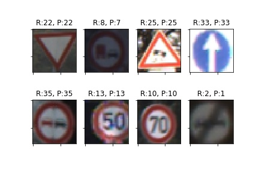
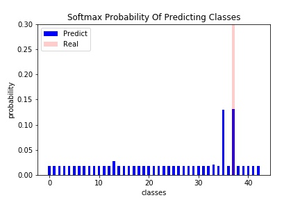

# Traffic Sign Classification
This notebook will teach you how to use CNN(Convolutional Neural Network) to let computer distinguish category of traffic sign. My structure of CNN composed of 4 convolutional layers including Dropout layer with probability of 0.5 and 2 fully connected layers, this model is based on empirically. And the activations whence I apply are `RELU` in each of convolutional layers, `TANH` in 2 elapsed fully connected layer, and `SOFTMAX` in the output layer.       

## Dataset
Two options can be used to obtain dataset, by [script](dowload_dataset.sh) and by link: [train](http://benchmark.ini.rub.de/Dataset/GTSRB_Final_Training_Images.zip), [test](http://benchmark.ini.rub.de/Dataset/GTSRB_Final_Test_Images.zip). For executing notebook facilely, I recommend you directly executes this script, `dowload_dataset.sh`.

## Result

 
Predictive Results

 

 
Histogram of Softmax Probability of Predictions.

