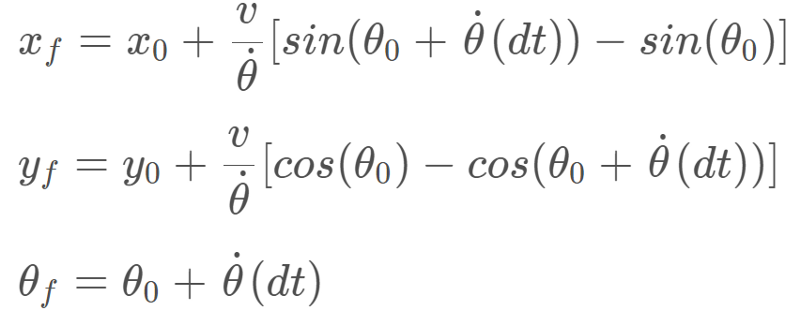

# Overview
This repository contains all the code needed to complete the final project for the Localization course in Udacity's Self-Driving Car Nanodegree.

 

## Project Introduction
Your robot has been kidnapped and transported to a new location! Luckily it has a map of this location, a (noisy) GPS estimate of its initial location, and lots of (noisy) sensor and control data.

In this project you will implement a 2 dimensional particle filter in C++. Your particle filter will be given a map and some initial localization information (analogous to what a GPS would provide). At each time step your filter will also get observation and control data. 

## Running the Code
This project involves the Term 2 Simulator which can be downloaded [here](https://github.com/udacity/self-driving-car-sim/releases)

This repository includes two files that can be used to set up and intall uWebSocketIO for either Linux or Mac systems. For windows you can use either Docker, VMware, or even Windows 10 Bash on Ubuntu to install uWebSocketIO.

Once the install for uWebSocketIO is complete, the main program can be built and ran by doing the following from the project top directory.

1. mkdir build
2. cd build
3. cmake ..
4. make
5. ./particle_filter

Alternatively some scripts have been included to streamline this process, these can be leveraged by executing the following in the top directory of the project:

1. ./clean.sh
2. ./build.sh
3. ./run.sh

#### The Map*
`map_data.txt` includes the position of landmarks (in meters) on an arbitrary Cartesian coordinate system. Each row has three columns
1. x position
2. y position
3. landmark id

## Success Criteria
The things the grading code is looking for are:

1. **Accuracy**: your particle filter should localize vehicle position and yaw to within the values specified in the parameters `max_translation_error` and `max_yaw_error` in `src/main.cpp`.

2. **Performance**: your particle filter should complete execution within the time of 100 seconds.

## Concept
First of all, we have to setup initial information of particles including weight, coordinates. Once we accomplish to initialize, we can start to predict coordinates and weights for paticles. Furthermore, the predicted results are often not accurate, so we have to correct it. Secondly, according to Markov assumption and Naive Bayes equation, we can use the previous to update the prediction. In addition, we have to resample the weights, resampling wheel, of the particles after updating. Finally, we can repeat these steps to get better predicted result. 

 
equation of prediction when rate of yaw is too low

## Good Resources
1. [Kidnapped theory](https://medium.com/intro-to-artificial-intelligence/kidnapped-vehicle-project-using-particle-filters-udacitys-self-driving-car-nanodegree-aa1d37c40d49)
2. [Localisation theory](https://medium.com/intro-to-artificial-intelligence/localisation-udacitys-self-driving-car-nanodegree-8440a1f83eab)

