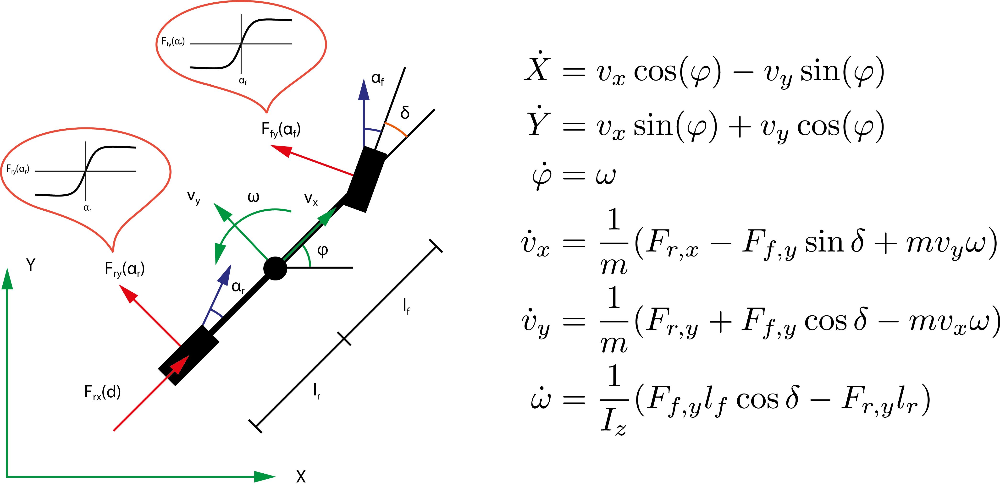

# CarND-Controls-MPC
Self-Driving Car Engineer Nanodegree Program

---

## Goal
The project aim to match the trajectory of the vehicle. In the simulator, the green line means your prediction, so your responsibility is to get a perfect polynomial equation for matching the yellow line, the trajectory. Therefore, the more closer you fit the green to the yellow, the more higher accuracy you get.

<div align='center'>
  <br/>
</div>


=======
## Briefly to say
I will dive into describe each of the functions as best as I can.

#### Part 1
In [main.cpp](./src/main.cpp) you will get the json data compose to `ptsx, ptsy, x, y, psi, speed, steering_angle, throttle`
1. ptsx: facing x coordinate of vehicle
2. ptsy: facing y coordinate of vehicle 
3. x: x coordinate of vehicle
4. y: y coordinate of vehicle
5. psi: angle of tire proportion to the centre
6. speed: vehicle speed
7. steering_angle: steering angle 
8. throttle: vehicle throttle

### Part 2
Once you get vehicle data, it is time to rock.

---

#### First
we have to predict the next motion. Let's give our initial equation a shot :D
```
for(size_t i = 0; i < ptsx.size(); i++) {
    double shift_x = ptsx[i] - px;
    double shift_y = ptsy[i] - py;
    ptsx[i] = (shift_x*cos(0-psi)-shift_y*sin(0-psi));
    ptsy[i] = (shift_x*sin(0-psi)+shift_y*cos(0-psi));
}

pred_x = pred_x + v * cos(0) * dt;
pred_y = pred_y + v * sin(0) * dt;

double pred_psi = 0 + v * (-steer_value/Lf) * dt;
double pred_v = v + throttle_value * dt;
double pred_cte = cte + (v * sin(epsi) * dt);
double pred_epsi = epsi + v * (-steer_value/Lf) * dt;
```

<<<<<<< HEAD
Here is the useful illustration I infer the below to this [website](http://control.ee.ethz.ch/~racing/research.php)

<div align='center'>
  
</div>

=======
#### Second

Unfortunately, our performance of predictions are definitely very poor, so we have correct these by using cost function. That is, the cost function can help us to reward or punish the weights of the polynomial equation we purchase. (Polynomail Equation I believe everyone are quite adept to it.)

I use the C-lib called, CppAD,  to get our ideal equation. This can save us a lot of efforts to solve the optimizing problem.
Please infer to [MPC.cpp](./src/MPC.cpp)
```
# Our goal: minimize the equation factor to achieve the following conditions.
# The equation we want to solve:
# Each _FACTOR is based on the empirical.

CTE_FACTOR * (cte - ref_cte)^2 // minimize CTE(Cross-Track-Error) 
+ EPSI_FACTOR * (epsi - ref_epsi)^2 // minimize EPSI
+ (speed - ref_speed)^2 // minimize Speed
+ DELTA_FACTOR * delta^2 // minimize Delta
+ ACCELERATE_FACTOR * accelerate^2 // minimize accelerate
```
In the next step, we must to apply some constraints to this equation or let's say contrained values. I use PolyEQ to represent the polynomial equation.

1. Asign all the values to the correspondent variables, such as `x0 = vars['x0']`
2. Restricted by the simulated environment, we must to contrain the steering angle(degree of -25 to 25) and throttle values(-1 to 1).
3. Based on the PolyEQ(x0), we can get the estimated angle of the tire. That is the most important part to the adjusting the steer. `psides0 = atan(PolyEQ(x0))`
4. Once again, we apply the pragmatic situation, such as weighted mean center, to constrain the equation.
    ```
    fg[2 + x_start + i] = x1 - (x0 + v0 * CppAD::cos(psi0)*dt);
    fg[2 + y_start + i] = y1 - (y0 + v0 * CppAD::sin(psi0)*dt);
    fg[2 + psi_start + i] = psi1 - (psi0 + v0 * delta0 / Lf * dt);
    fg[2 + v_start + i] = v1 - (v0 + a0 * dt);
    fg[2 + cte_start + i] = cte1 - ((f0 - y0) + (v0 * CppAD::sin(epsi0)*dt));
    fg[2 + epsi_start + i] = epsi1 - ((psi0 - psides0) + v0 * delta0 / Lf * dt);
    ```
4. When we setup all the regulation and equation, we use `CppAD::ipopt::solve` to get the optimized parameters for the polynomial function. 
5. Lastly, we apply these optimized parameters to our polynomial function, and then we can get the corrected steering angle and throttle value.
    ```
    steer_value = -vars[0]/(deg2rad(25)*Lf); // the optimized value is radians, so we have to normalize it.
    throttle_value = vars[1];
    ```

## Dependencies

* cmake >= 3.5
 * All OSes: [click here for installation instructions](https://cmake.org/install/)
* make >= 4.1(mac, linux), 3.81(Windows)
  * Linux: make is installed by default on most Linux distros
  * Mac: [install Xcode command line tools to get make](https://developer.apple.com/xcode/features/)
  * Windows: [Click here for installation instructions](http://gnuwin32.sourceforge.net/packages/make.htm)
* gcc/g++ >= 5.4
  * Linux: gcc / g++ is installed by default on most Linux distros
  * Mac: same deal as make - [install Xcode command line tools]((https://developer.apple.com/xcode/features/)
  * Windows: recommend using [MinGW](http://www.mingw.org/)
* [uWebSockets](https://github.com/uWebSockets/uWebSockets)
  * Run either `install-mac.sh` or `install-ubuntu.sh`.
  * If you install from source, checkout to commit `e94b6e1`, i.e.
    ```
    git clone https://github.com/uWebSockets/uWebSockets
    cd uWebSockets
    git checkout e94b6e1
    ```
    Some function signatures have changed in v0.14.x. See [this PR](https://github.com/udacity/CarND-MPC-Project/pull/3) for more details.

* **Ipopt and CppAD:** Please refer to [this document](https://github.com/udacity/CarND-MPC-Project/blob/master/install_Ipopt_CppAD.md) for installation instructions.
* [Eigen](http://eigen.tuxfamily.org/index.php?title=Main_Page). This is already part of the repo so you shouldn't have to worry about it.
* Simulator. You can download these from the [releases tab](https://github.com/udacity/self-driving-car-sim/releases).
* Not a dependency but read the [DATA.md](./DATA.md) for a description of the data sent back from the simulator.


## Basic Build Instructions

1. Clone this repo.
2. Make a build directory: `mkdir build && cd build`
3. Compile: `cmake .. && make`
4. Run it: `./mpc`.

## Tips

1. It's recommended to test the MPC on basic examples to see if your implementation behaves as desired. One possible example
is the vehicle starting offset of a straight line (reference). If the MPC implementation is correct, after some number of timesteps
(not too many) it should find and track the reference line.
2. The `lake_track_waypoints.csv` file has the waypoints of the lake track. You could use this to fit polynomials and points and see of how well your model tracks curve. NOTE: This file might be not completely in sync with the simulator so your solution should NOT depend on it.
3. For visualization this C++ [matplotlib wrapper](https://github.com/lava/matplotlib-cpp) could be helpful.)

